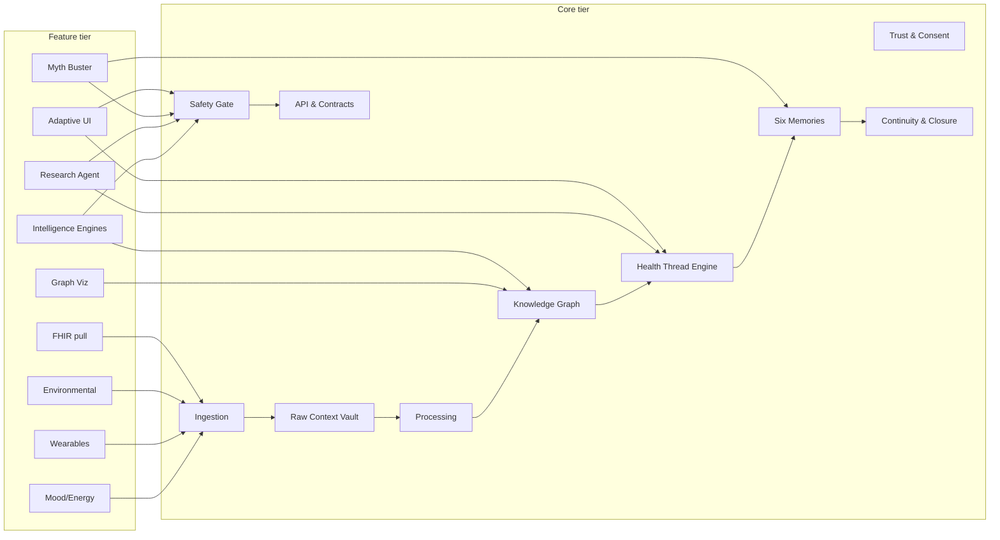

# Component Map — Core vs Feature

This document is the canonical list of WellBe components, split into two tiers:

- **CORE components** — the spine of the product. They are foundational, everything else depends on them, and they map to the lower architectural layers (L0–L5, L7) in `../system-design/architecture.md`. Changes here have the widest blast radius.
- **FEATURE components** — capabilities layered on top of the core. Each is individually shippable, phaseable, and (mostly) removable without breaking the spine. They consume core services through stable contracts.

The rule that separates the tiers: **a component is CORE if removing it would break the Capture → Connect → Clarify → Close → Correct loop or violate a system principle. Otherwise it is a FEATURE.** See `../system-design/system_principles.md`.

Layer references (`L0`–`L8`) map to `../system-design/architecture.md`. Feature IDs (`WB2-Fxxx`) map to `../feature-backlog/feature_backlog.md`.

---

## CORE components

| # | Core component | Layer | One-line purpose | Depends on |
|---|---|---|---|---|
| C1 | Trust & Consent Service | L0 | Owns auth identity, consent scopes, share grants, revocation log, and the cross-patient opt-in gate. | — (root of trust) |
| C2 | Raw Context Vault | L1 | Immutable, append-only store of every raw input with full provenance. Never mutated. | C1 |
| C3 | Ingestion Layer | L1 | Source-type adapters (manual, document, SMS, device, FHIR, environmental) that write into the Vault. | C1, C2 |
| C4 | Processing Pipeline | L2 | Extracts entities, facts, and signals from raw context; computes quality/confidence scores. | C2 |
| C5 | Evidence & Provenance Service | L2 | Links every derived fact back to its raw source; enforces "no orphan claims". | C2, C4 |
| C6 | Knowledge Graph Store | L2 | Typed nodes + evidence-weighted edges connecting entities across threads, time, and sources. | C4, C5 |
| C7 | Health Thread Engine + State Machine | L3 | The central product object: lifecycle, linking, status for one unresolved concern. | C5, C6 |
| C8 | Six Memories Store | L4 | Story, Clinical, Pattern, Decision, Responsibility, Equity/Access memories around each thread. | C6, C7 |
| C9 | Continuity & Closure Engine | L5 | Pending item ledger, referral lifecycle, result tracker, post-visit plan checker, repeat-visit view. | C7, C8 |
| C10 | Safety & Governance Gate | L7 | Mandatory gate before any user-facing AI output: do-not-diagnose, panic language, provenance, bias controls. | C5, C7 |
| C11 | Correction Service | L0/L4 | Captures user repairs as new source-linked layers; never overwrites raw or derived data. | C2, C5, C8 |
| C12 | Notification & Audit Service | L7 | Append-only audit trail of every event; user-facing notifications (closure-oriented, low-alarm). | C1 |
| C13 | API & Contract Layer | L8 (edge) | REST/OpenAPI surface + webhooks; the single contract boundary all surfaces and features call. | C1, C7, C9, C10 |

### Why these are core
- **C1–C5** implement the Data Factory and provenance principles (raw immutability, every output traceable, correction as safety infrastructure).
- **C6–C9** implement Threads-not-files, uncertainty-as-object, and closure-beats-visibility.
- **C10** implements investigate-never-diagnose and "safety gate before any AI output reaches the user" — the single hardest architectural rule.
- **C11–C13** implement correction, audit, and the contract boundary every other tier depends on.

---

## FEATURE components

Each feature consumes core services and can be phased independently. "Phase" follows `../feature-backlog/feature_backlog.md`.

| # | Feature component | Feature ID | Layer | One-line purpose | Depends on (core) | Phase |
|---|---|---|---|---|---|---|
| F-MOOD | Mood / Energy Logging | WB2-F034 | L1 | Capture emotional/energy state as first-class signals. | C3, C4, C6 | MVP |
| F-PEND | Pending / Referral / Result trackers (surfaces) | WB2-F007/F008/F020 | L5 | User-facing surfaces over the Continuity Engine. | C9, C13 | MVP |
| F-PACKET | Visit Packet + Scoped Share/Export | WB2-F011/F024 | L8 | User-controlled, source-linked clinician summary and revocable share. | C1, C7, C10 | MVP |
| F-SAFENET | Normal-test safety net | WB2-F006 | L6 | Keeps unresolved symptoms visible after a normal result. | C7, C9, C10 | MVP |
| F-KG-VIZ | Knowledge Graph Visualization | WB2-F033 | L8 | Thread-scoped and investigation-landscape graph exploration UI. | C6, C13 | Post-MVP |
| F-ENGINES | Intelligence Engine Suite | WB2-F042 | L3/L4 | Pattern, Temporal, Confounder, Missing-Data, Contradiction engines over the graph. | C6, C7, C8 | Post-MVP |
| F-RESEARCH | Research Agent | WB2-F036 | L6 | Source-linked, evidence-graded external lookups tied to a thread. | C7, C10 | Post-MVP |
| F-MYTH | Myth Buster (personal theory evaluator) | WB2-F035 | L6 | Structured evaluation of a user's own theory against their own data. | C6, C7, C8, C10 | Post-MVP |
| F-ENV | Environmental Context Ingestion | WB2-F037 | L1 | Weather, air quality, allergens, public-health/conflict signals (city-level, opt-in). | C3, C4, C6 | Post-MVP |
| F-WEAR | Wearable Integration | WB2-F039 | L1 | Import biometric streams as longitudinal context. | C3, C4, C6 | Post-MVP |
| F-XDEV | Cross-Device Intelligence | WB2-F038 | L2 | Baseline/drift/asymmetry across paired devices. | C6, F-WEAR | Post-MVP |
| F-AUI | Health-Adaptive UI | WB2-F040 | L8 | Ambient UI signal driven by triage state + baseline deviation. | C7, C10, C13 | Post-MVP |
| F-FHIR | Medical Institution Integration (user-pull FHIR) | WB2-F041 | L1 | User-initiated SMART-on-FHIR import of own records. | C1, C3, C4 | Deferred |

### Feature → core dependency rules
- Every integration feature (`F-ENV`, `F-WEAR`, `F-FHIR`) writes **only** through the Ingestion Layer (C3) into the Raw Context Vault (C2). No feature bypasses the Data Factory. See `../system-design/integrations.md`.
- `F-KG-VIZ` and `F-ENGINES` are **read/annotate** consumers of the Knowledge Graph Store (C6); they never assert diagnosis (`may_explain` is the strongest causal edge).
- `F-RESEARCH`, `F-MYTH`, `F-AUI` produce user-facing output and therefore **must** pass the Safety & Governance Gate (C10) before rendering.
- `F-XDEV` depends on `F-WEAR` and cannot surface insight until its baseline period completes.

---

## Tier boundary diagram

Detailed data flow and dependency direction are in `core-stack-relations.md`.
