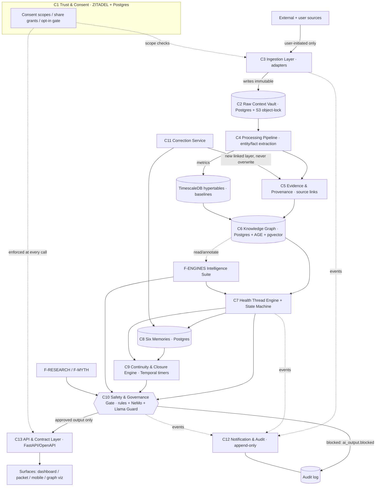
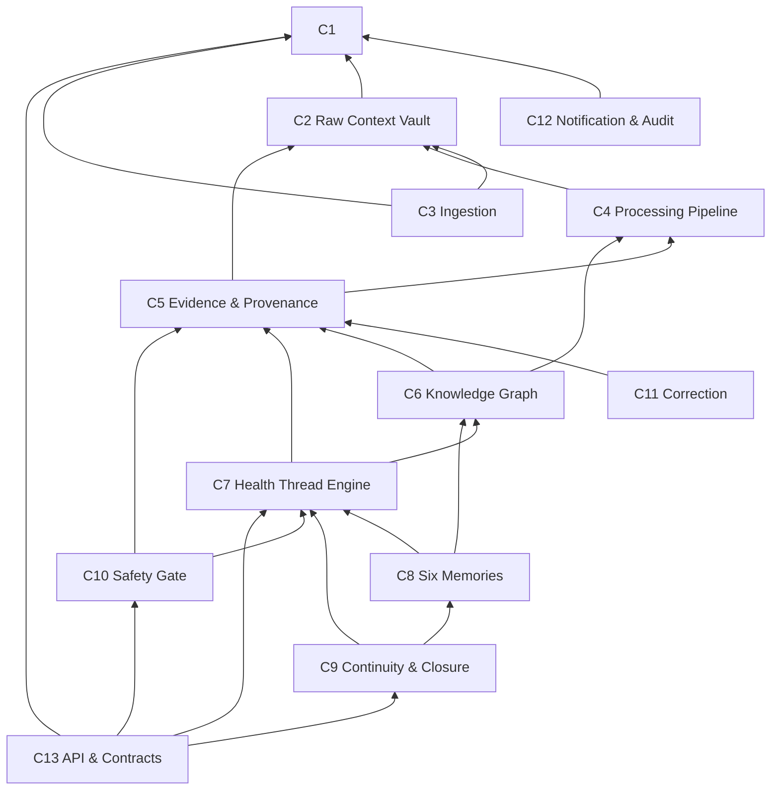

# Core Stack Relations

How the core components (`C1`–`C13` in `component-map.md`) and their backing technologies (`tech-stack.md`) relate: the data flow, the dependency direction, and what depends on what.

---

## Dependency rule (invariant)

> **Lower layers must not depend on upper layers. The Safety & Governance Gate runs before any user-facing AI output. The Health Thread Engine consumes Data Factory outputs but cannot overwrite raw context or remove provenance.** (`../system-design/architecture.md`)

Concretely:
- Trust & Consent (C1) is the root; everything reads consent from it, it reads from nothing.
- The Raw Context Vault (C2) is append-only and immutable; nothing rewrites it. Corrections (C11) add new linked layers.
- The Knowledge Graph (C6) and Health Thread Engine (C7) read derived facts; they never reach back and mutate raw context.
- Anything that emits user-facing AI output (features F-RESEARCH/F-MYTH/F-AUI and any engine surfacing text) **must** route through the Safety Gate (C10).

---

## End-to-end data flow

---

## Dependency direction (who depends on whom)

Arrows point **toward the dependency** (A → B means "A depends on B"). The graph is acyclic and bottoms out at C1 (consent) and C2 (raw vault) — the two roots of trust and truth.

---

## What depends on what — table

| Component | Directly depends on | Provides to | Backing tech (`tech-stack.md`) |
|---|---|---|---|
| C1 Trust & Consent | — | all (enforced at C13) | ZITADEL, Postgres |
| C2 Raw Context Vault | C1 | C4, C5, C11 | Postgres + S3 object-lock |
| C3 Ingestion Layer | C1, C2 | C2 | FastAPI adapters, Temporal (durable imports) |
| C4 Processing Pipeline | C2 | C5, C6, TimescaleDB | Python workers, OCR pipeline, Dramatiq/Temporal |
| C5 Evidence & Provenance | C2, C4 | C6, C7, C10, C11 | Postgres |
| C6 Knowledge Graph | C4, C5, TimescaleDB | C7, C8, F-ENGINES, F-KG-VIZ | Postgres + Apache AGE + pgvector |
| C7 Health Thread Engine | C5, C6 | C8, C9, C10, C13 | Python service, state machine |
| C8 Six Memories | C6, C7 | C9, F-MYTH | Postgres |
| C9 Continuity & Closure | C7, C8 | C10, C13 | Temporal (durable timers) |
| C10 Safety Gate | C5, C7 | C13 (gates all AI output) | Rule engine + NeMo Guardrails + Llama Guard |
| C11 Correction Service | C2, C5, C8 | C5, C8 | Python service |
| C12 Notification & Audit | C1 | users / ops | Postgres (append-only), Redis Streams |
| C13 API & Contracts | C1, C7, C9, C10 | all surfaces | FastAPI / OpenAPI 3.1 |

---

## Three load-bearing relationships

1. **Vault → Provenance → everything (C2 → C5 → …).** Every derived fact, graph edge, thread annotation, and AI output carries a chain back to an immutable raw event. Removing or weakening C5 breaks "every output has provenance" and "no orphan claims". This is why C5 sits between the Vault and both the graph and the safety gate.

2. **Graph ↔ Thread ↔ Engines (C6 ↔ C7 ↔ F-ENGINES).** The Knowledge Graph is the shared substrate; the Health Thread Engine organizes a slice of it around one concern (`thread_subgraph_id`); the Intelligence Engines read the graph and write back first-class objects (patterns, contradictions, data gaps). Engines depend on the graph, not vice versa — the graph stands alone without them. See `../system-design/knowledge_graph.md` and `../system-design/intelligence_engines.md`.

3. **Everything user-facing → Safety Gate → API (… → C10 → C13).** No path exists from an engine, agent, or thread directly to a surface. The gate is the only door to C13 for AI output; if it is down, output is blocked and logged (`ai_output.blocked`), never passed through. This makes "investigate, never diagnose" and "safety gate before any AI output" structurally enforced, not merely a policy.

---

## Consent as a cross-cutting concern

C1 is drawn as a dependency root, but in practice consent checks are **enforced at the C13 boundary on every request** and at C3 for every ingestion. Cross-patient comparison (WB2-F032) has **no enabled data path** unless the user has flipped the explicit opt-in gate in C1 — consistent with `../../.cursor/rules/wellbe-vision-guardrails.mdc`.
