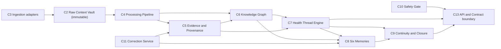
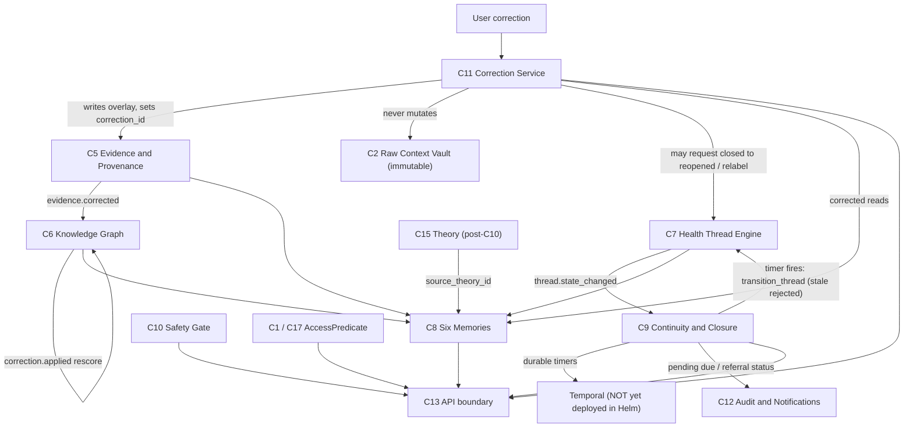

# Research Brief: Memory, Continuity, and Correction Gates — C8 Six Memories, C9 Continuity & Closure, C11 Correction Service

**Date prepared:** 2026-06-01
**Prepared for:** External consultant / research reviewer
**Prepared by:** WellBe agent
**Research scope:** Three open research gates that block implementation of the L4–L5 / L0 product memory, continuity, and correction layer.

This file bundles three coupled research assignments into one self-contained document. A consultant should be able to read this file end-to-end and produce decision-ready recommendations **without needing access to the repository**.

The three gates are:

1. **Assignment A — C8 Six Memories Store:** how to structure, partition, and populate the six memory types (Story / Clinical / Pattern / Decision / Responsibility / Equity) as authored-vs-derived surfaces that reference C5/C6 rather than copying facts. Jira Spike **WEL-136**, blocks **WEL-70**. Decision Record stub: `docs/decisions/six-memories-store-structure.md`.
2. **Assignment B — C9 Continuity & Closure Engine:** the Pending Item Ledger, durable timers, referral/result lifecycle, and the normal-test safety net, driven by the C7 `thread.state_changed` event and enforced so a stale or late timer can never force an unsafe Health Thread transition. Jira Spike **WEL-137**, blocks **WEL-67**. Decision Record stub: `docs/decisions/continuity-pending-ledger-durable-timers.md`.
3. **Assignment C — C11 Correction Service:** layered, source-linked, non-mutating correction overlays written through C5 that never touch the C2 Raw Context Vault or C4 extracted facts, with deterministic read-resolution for downstream consumers (C6 / C8 / C13). Jira Spike **WEL-138**, blocks **WEL-71**. Decision Record stub: `docs/decisions/correction-service-layered-provenance.md`.

The three are bundled because they share the same dependency spine (C5 provenance, C6 graph, C7 thread state), they interlock (a correction in C11 must change what C8 reads and what C9 acts on), and getting any one of them structurally wrong is hard to retrofit once C13 exposes these surfaces.

---

## 0. How to use this document

> **Critical constraint — agents may not self-research.** WellBe's research protocol requires that the consultant/user supplies the research and the proposed answers. This brief deliberately **states the questions and the constraints but does not answer them.** Do not treat any sentence here as a pre-decided answer to a research question.

For **each** of the three components (C8, C9, C11), please return a research package containing:

1. **Approaches considered** — at least 2–4 genuinely distinct options, each with pros, cons, and the standard/precedent it draws on. Cite your sources.
2. **Recommended decision** — one clear, concrete, implementable recommendation per component, expressed so it can be copied into the Decision Record's `Decision` section.
3. **Trade-offs accepted** and **open risks**.
4. **Integration notes** — how your recommendation satisfies the already-decided constraints in §4 and the interfaces in §5–§6.
5. **Test/acceptance criteria** — what proves the recommendation is correct and safe.

Your return must map cleanly onto each Decision Record's structure: `Research provided` → `Approaches considered` → `Decision` → `Trade-offs accepted` → `Implementation notes`. The matching question text and sub-questions for each gate are reproduced verbatim in §5 below.

You may cite external standards (FHIR, W3C PROV, Temporal docs, event-sourcing/CQRS literature, bitemporal-data literature, etc.). Final recommendations must fit the WellBe constraints in this brief; where a standard conflicts with a WellBe safety rule, the WellBe rule wins.

---

## 1. Project context — what WellBe is

WellBe is a **Patient-Centered Health Investigation OS**. Its sovereign core is a **Personal Shared Health Memory OS** — a user-controlled memory layer that helps individuals carry health context forward until each concern is resolved, explained, monitored, or safely handed off (`docs/system-design/platform_identity.md`).

**Personal-first / controller identity (non-negotiable):**

- The individual is **always** the data controller and the audience every feature must benefit (`docs/system-design/system_principles.md` §1; `docs/system-design/platform_identity.md`).
- Clinicians, care teams, institutions, and researchers may use role-specific workspaces **only** through explicit, scoped, time-boxed, purpose-bound, revocable grants. No audience gets default access.
- Cross-patient comparison is always opt-in and user-initiated; institutions receive aggregate-only, consented intelligence — never default individual-level data.
- WellBe **investigates, never diagnoses**.

**The operating loop** (`docs/system-design/platform_identity.md`):

```text
Capture -> Connect -> Investigate -> Clarify -> Close -> Correct
```

| Step | What it does | Relevance to this brief |
|---|---|---|
| Capture | Collect raw and structured health context | Feeds C2 vault via C3 adapters |
| Connect | Link signals into a Health Thread | C6 graph + C7 thread |
| Investigate | Structured research process over a thread (Investigation, Theories, evidence) | C14/C15/C16 — context for C8 Pattern Memory |
| Clarify | Surface what is known, unknown, missing, pending, worsening | C8 memories + C9 pending ledger |
| Close | Track open loops until resolved, explained, monitored, or safely handed off | **C9 — the core of Assignment B** |
| Correct | Let the user repair inaccurate or incomplete memory | **C11 — the core of Assignment C** |

**Non-negotiable safety rules** (`docs/safety/do_not_diagnose_rules.md`, `docs/system-design/system_principles.md`, `docs/system-design/health_thread_state_machine.md`):

1. **Never diagnose.** No "you have X", no ruling out, no ranked differential, no probabilistic diagnosis, no medication directives, no clinical-judgment-of-a-third-party.
2. **Cannot close a thread on a single normal test.** If symptoms persist after a normal test, the thread stays active or watchful-waiting with explicit follow-up criteria. (`health_thread_state_machine.md` → Safety rules.)
3. **Every output has provenance / no orphan claims.** A derived claim with no traceable source may not be surfaced. (`system_principles.md` §5.)
4. **Raw data immutability.** Original inputs are never overwritten; corrections layer on top. (`system_principles.md` §11; `platform_identity.md` design principle 6.)
5. **Safety gate before every user-facing AI output.** No bypass. (`do_not_diagnose_rules.md` §6.)

These five rules are the acceptance frame for all three assignments. A recommendation that makes any of them violable is, by definition, wrong.

---

## 2. System / architecture context

### 2.1 The C1–C17 component map

Canonical source: `docs/architecture/component-map.md`. The three gates in this brief are **C8, C9, C11**; the rest are listed because all three integrate with them.

| # | Component | Layer | One-line purpose | Depends on |
|---|---|---|---|---|
| C1 | Trust & Consent Service | L0 | Auth identity, consent scopes, share grants, revocation log, cross-patient opt-in gate | — (root of trust) |
| C2 | Raw Context Vault | L1 | Immutable, append-only store of every raw input with full provenance | C1 |
| C3 | Ingestion Layer | L1 | Source-type adapters that write into the Vault | C1, C2 |
| C4 | Processing Pipeline | L2 | Extracts entities, facts, signals; quality/confidence scores | C2 |
| C5 | Evidence & Provenance Service | L2 | Links every derived fact to its raw source; enforces no-orphan-claims | C2, C4 |
| C6 | Knowledge Graph Store | L2 | Typed nodes + evidence-weighted edges across threads/time/sources | C4, C5 |
| C7 | Health Thread Engine + State Machine | L3 | Central product object: lifecycle/status for one unresolved concern | C5, C6 |
| **C8** | **Six Memories Store** | **L4** | **Story / Clinical / Pattern / Decision / Responsibility / Equity memories around each thread** | **C6, C7** |
| **C9** | **Continuity & Closure Engine** | **L5** | **Pending item ledger, referral lifecycle, result tracker, post-visit checker, repeat-visit view** | **C7, C8** |
| C10 | Safety & Governance Gate | L7 | Mandatory gate before any user-facing AI output | C5, C7 |
| **C11** | **Correction Service** | **L0/L4** | **Captures user repairs as new source-linked layers; never overwrites raw or derived data** | **C2, C5, C8** |
| C12 | Notification & Audit Service | L7 | Append-only audit trail of every event; closure-oriented notifications | C1 |
| C13 | API & Contract Layer | L8 (edge) | REST/OpenAPI + webhooks; single contract boundary all surfaces call | C1, C7, C9, C10 |
| C14 | Investigation Engine | L6 | Investigation object lifecycle/status, scope, participants, evidence bundles | C7, C5, C6, C10 |
| C15 | Theory Service | L6 | Theory object: evidence-for/against, missing-data, status, safety level; never diagnosis | C6, C8, C10 |
| C16 | External Evidence Graph + Research Watch | L6 | Separate external-source graph, source-quality tiers, relevance links | C5, C6, C10 |
| C17 | Workspace, Role & Grant Layer | L0/L9 | Role-specific workspaces + deep grant model; individual stays controller | C1, C12 |

### 2.2 The layered stack and data flow

Canonical flow (`docs/architecture/component-map.md` tier diagram). Note that **ingestion (C3) writes into the vault (C2)** — the vault is the destination, not the source, of ingestion:



In one sentence: raw inputs land immutably in C2, C4 extracts facts, C5 makes every derived fact source-linked, C6 turns facts into a typed graph, C7 owns the lifecycle of each concern, **C8 organizes memory around each thread, C9 tracks open loops until closure, and C11 lets the user correct any of it without mutating the underlying data** — and nothing user-facing renders without passing C10 and crossing the C13 boundary.

### 2.3 The technology stack (already decided)

Source: `docs/decisions/health-thread-state-machine-enforcement.md` (stack table) and repo state.

| Concern | Choice |
|---|---|
| Backend language | Python 3.13 |
| Backend framework | FastAPI + Pydantic v2 |
| Primary datastore | PostgreSQL 17 (schema-per-component) |
| Durable workflows | Temporal (long-running, must-not-lose-progress flows) |
| Lightweight jobs | Dramatiq + Redis |
| Events | Transactional outbox (Postgres) + Redis Streams |
| Graph store | Apache AGE (Cypher on Postgres) + pgvector |

Schema-per-component convention is already in use: `vault.*` (C2), `evidence.*` (C5), `graph.*` (C6), `c14.*` (Investigations), `c15.*` (Theories), `external_kg.*` / `external_bridge.*` (C16), `consent.*` / `access.*` / `workspace.*` (C1/C17). C8/C9/C11 will follow the same pattern (e.g. `c8.*`, `c9.*`, `c11.*` — exact naming is part of what you may recommend).

### 2.4 Current code state for the three gates (grounding)

- `backend/packages/c8_memories/`, `backend/packages/c9_continuity/`, `backend/packages/c11_correction/` are **empty scaffolds** — each contains only a `pyproject.toml` declaring deps on `wellbe-contracts`, `wellbe-platform`, `wellbe-db`, `wellbe-events`. No models or services yet.
- `backend/apps/continuity-worker/` is a **stub**: `src/wellbe_continuity_worker/main.py` is a one-line docstring (`"C9 Continuity Worker: pending item ledger, referral tracker, Temporal timer callbacks."`).
- `db/migrations/versions/005_c5_evidence_schema.py` already created `evidence.evidence_links` **with a nullable `correction_id` column** and the `'correction_service'` value in both the `confidence_basis` and `linked_by` CHECK constraints — a **preparatory hook for C11** (the column exists; the C11 model and write path do not). The same migration installs the deferred `enforce_no_orphan_claims` trigger and an INSERT/SELECT-only `wellbe_evidence` DB role.
- The contracts package `backend/packages/contracts/src/wellbe_contracts/` already defines the **stable DTO patterns** to mirror: `c5_evidence/__init__.py` (`EvidenceRef`, `EvidenceLink`, `CorrectionId`, `EvidenceCorrectedPayload` with `correction_id`), `c7_thread/__init__.py` (`HealthThreadStatus`, `ALLOWED_TRANSITIONS`, `ThreadStateChangedPayload`, `THREAD_STATE_CHANGED = "thread.state_changed"`), and `events/outbox.py` (`OutboxEvent`).
- The event/outbox machinery lives in `backend/packages/events/src/wellbe_events/` (`outbox.py`, `models.py`, `publisher.py`).
- **Infra fact for C9:** the Helm chart `infra/helm/wellbe-local/` has **no Temporal deployment template** — its configmaps reference `temporalHost: "temporal:7233"`, but no Temporal server is actually deployed to the kind cluster. Local `infra/local/docker-compose.yml` does run a single-node `temporalio/auto-setup` dev server + UI. There is a `backend/apps/temporal-worker/` and the `c9_continuity` package declares a temporal-related dependency, but **standing up Temporal in the cluster is unbuilt work that C9's design must account for.**

---

## 3. Six Memories — domain background (for Assignment A)

The "Six Memories" framework predates the build and is archived at `archive/research/shared_health_memory/04_shared_health_memory_framework/six_memories.csv`. Faithful summary:

| Memory | Primary user (research framing) | What it remembers |
|---|---|---|
| Story Memory | Patient | Patient's own words, main concern, fear, own theory, symptom timeline, daily-life impact, baseline change |
| Clinical Memory | Clinician / care team | Problems, medications, allergies, labs, imaging reports, notes, referrals, vitals, diagnoses (as **sourced records**, not WellBe conclusions) |
| Pattern Memory | Clinician / care team | Repeat visits, persistent symptoms after normal tests, lab trends, worsening patterns, unresolved complaints |
| Decision Memory | Clinician / care team | What was considered, ruled out, uncertain, or should trigger reassessment |
| Responsibility Memory | Patient / clinician / admin | Owners and states for pending results, abnormal findings, referrals, repeat tests, follow-up |
| Equity & Access Memory | Patient / caregiver / care team | Language, access barriers, caregiver involvement, transport, digital access, disability accommodations, trust/cultural safety |

> **Identity guardrail when reading the above:** the research framing labels some memories "clinician/care-team". In WellBe, the **individual is always the controller** and every memory must benefit the individual; clinician access is only via grant. "Diagnoses" stored in Clinical Memory must be modeled as **sourced record facts** (an imported note said X), never as a WellBe conclusion — consistent with C6's `Finding`/`ConditionMention` vs `ConditionHypothesis` rule (`docs/decisions/knowledge-graph-node-edge-schema.md`). Pattern Memory must respect the "no closure on a single normal test" rule and the do-not-diagnose ceiling.

---

## 4. Already-decided constraints every recommendation MUST respect

These are **approved** Decision Records. They are not open questions. Your recommendations must fit inside them; where you believe a constraint should change, flag it explicitly rather than assuming.

### 4.1 C7 — Health Thread state machine + `thread.state_changed` (binding for C8 and C9)

Source: `docs/decisions/health-thread-state-machine-enforcement.md`; contract in `wellbe_contracts/c7_thread/__init__.py`.

- C7 is the **only** authority for thread lifecycle transitions, via a domain `transition_thread(thread_id, target_status, actor, reason_code, evidence_refs, idempotency_key, expected_version, metadata)` command. **No component may directly patch `health_threads.status`.**
- Every valid transition is atomic in one Postgres transaction: update `health_threads.status` + `status_version`, insert `thread_state_transitions` (append-only history), insert an `outbox_events` row `event_type = 'thread.state_changed'`.
- Closure safety is enforced as **contextual guards** on top of edge validity: `explained -> closed` is rejected if closure is based only on one normal test, or if symptoms persist. `closed -> reopened` is always allowed for user correction.
- **C9 does not get called synchronously by C7.** C9 subscribes to `thread.state_changed` and starts/signals/cancels/replaces its own Temporal timers. If a C9 timer wants to move a thread, it must call `transition_thread`; **a stale timer command is rejected/no-oped by C7 — this is the desired race-safe behavior.**
- Event contract (schema_version 1) carries: `thread_id`, `patient_id`, `from_status`, `to_status`, `transition_seq`, `actor`, `reason_code`, `idempotency_key`, `correlation_id`, `trace_id`, `evidence_refs`, `safety_flags`, `metadata`. Consumers **order by `(thread_id, transition_seq)`** (not Redis global order) and **deduplicate on `event_id`**.
- The C7 decision already names `correction.applied` and `thread.state_changed` as events that trigger C6 rescoring — relevant to C11→C6 and C11→C8 propagation.

### 4.2 C5 — no-orphan provenance + the `correction_id` hook (binding for C11 and C8)

Source: `docs/decisions/evidence-provenance-no-orphan-enforcement.md`; `wellbe_contracts/c5_evidence/__init__.py`; migration `005`.

- All derived objects (facts, signals, **memory entries**, summaries, AI outputs) must have ≥1 `evidence_links` row before becoming visible. Enforced at the C5 application write gate **and** by a Postgres `DEFERRABLE INITIALLY DEFERRED` constraint trigger (`enforce_no_orphan_claims`).
- The **C5 write gate is the single point** where derived objects enter the system. No other component writes `extracted_facts`, `health_signals`, or `memory_entries` without going through C5. **This means C8 memory entries and C11 corrections are written through C5, not around it.**
- `evidence_links` already carries: `link_type` (`primary | corroborating | contradicting | contextual`), per-link `confidence`, `confidence_basis` (includes `correction_service`), `linked_by` (includes `correction_service`), and a nullable **`correction_id`** (FK if the link was created by a C11 correction).
- C5 emits `evidence.linked`, **`evidence.corrected`** (already has an `EvidenceCorrectedPayload` with `correction_id`, `old_link_type`, `new_link_type`), and `provenance.orphan_rejected`.
- Contradicting evidence is **stored, never deleted** (`link_type = contradicting`, negative weight in scoring). Corrections are expected to follow the same "add, don't delete" philosophy.

### 4.3 C2 — Raw Context Vault immutability (binding for C11)

Source: `docs/decisions/raw-context-vault-immutability-enforcement.md`.

- Four-layer append-only enforcement: no update/delete app API; runtime DB role has `INSERT, SELECT` only; RLS for patient isolation; `BEFORE UPDATE OR DELETE` trigger rejects any mutation. **A correction can never edit a raw event.**
- Even GDPR erasure is crypto-shred (destroy the per-user key) + an append-only audit marker — never a row delete/mutate. C11's "non-mutating overlay" model must be consistent with this.

### 4.4 C6 — graph node/edge schema + non-diagnosis ceiling (binding for C8 and C11)

Source: `docs/decisions/knowledge-graph-node-edge-schema.md`; external-evidence retrofit `docs/decisions/external-evidence-graph-separation.md`.

- Relational `kg_nodes`/`kg_edges` are authoritative for hot paths; Apache AGE is a projection. Every node/edge carries `patient_id` and `thread_ids[]`; isolation is via RLS + predicates, not one graph per thread.
- **`may_explain` is the strongest causal edge.** `causes`, `diagnoses`, `confirms_diagnosis`, `rules_out`, `proves` are prohibited at schema, service, and test layers. Use `ConditionHypothesis` (never bare `Condition`); imported diagnoses are `Finding`/`ConditionMention`, sourced, not WellBe conclusions.
- `PotentialScore` is materialized on the edge and recomputed asynchronously by scoring workers on events including `evidence.linked`, **`correction.applied`**, and `thread.state_changed`. C8 Pattern Memory reads from this scored graph; C11 corrections must trigger rescore so reads stay consistent.

### 4.5 C12 — append-only audit + closure-oriented notifications (binding for all three)

Source: `docs/decisions/c12-audit-notification-contract.md`.

- C12 is an append-only, tamper-evident, PHI-minimized audit ledger + a policy-driven notification service. No update/delete API; corrections are **new events that reference prior events** (same philosophy C11 must follow).
- Lower-case dotted event names `<component>.<domain>.<action>` (e.g. `c11.correction.applied`). Authority fields (`grant_id`, `role_binding_id`, `purpose_code`, `scope_codes`, `access_predicate_hash`) are mandatory on access/export/render events.
- Notifications that "close a loop or change next steps" (pending item due, referral/result status change, etc. — **C9 territory**) are notification-triggering; routine internals are audit-only. Notifications must be closure-oriented: what changed, why it matters, the next step. No diagnosis, no alarm, no false reassurance, no clinician blame.

### 4.6 C13 — versioned contract boundary (binding surface for all three)

Source: `docs/decisions/c13-versioned-api-contract-boundary.md`.

- Hybrid versioning: stable `/v1`, new `/v2` path-versioned resources; `schema_version` in every v2 DTO; `additionalProperties: false` for authorization/safety DTOs.
- Every derived claim returned by C13 must carry a `SourceRefV2` or be rejected with `provenance_missing`. C13 must enforce C1/C17 access predicate before retrieval, C10 render token before AI output, and emit C12 audit on critical paths. **Whatever C8/C9/C11 expose becomes a stable C13 contract.**

### 4.7 C1 / C17 — deep grant / role / workspace (binding for visibility)

Source: `docs/decisions/deep-grant-role-workspace-model.md`.

- Workspace membership is **never** data access. Every read/search/export resolves through C1 into an `AccessPredicate` (not a bare boolean), then C12 audit, before data leaves the boundary.
- `full-investigation` never compiles to `WHERE patient_id = ?`; it is an allowlist + denylist. Clinician contributions default to annotations / pending-controller-acceptance — **this routes through C11** (proposed changes become permanent only after controller acceptance).

### 4.8 C10 — safety gate evaluation contract (binding for any output)

Source: `docs/decisions/safety-gate-evaluation-contract.md`.

- Mandatory synchronous gate; deterministic hard-safety rules run before model guardrails. Any C8 memory summary, C9 pending-item narrative, or C11-corrected view that is rendered as AI/AI-assisted output must carry a C10 render token bound to the exact output hash. C8 Pattern Memory / Theory summaries are explicitly post-C10 only (`docs/decisions/theory-object-evaluation-and-safety.md`).

### 4.9 C14 / C15 / C16 — Investigation, Theory, External Evidence (context for C8 Pattern Memory)

Sources: `docs/decisions/investigation-object-and-thread-coupling.md`, `theory-object-evaluation-and-safety.md`, `external-evidence-graph-separation.md`.

- C14 Investigation is a first-class aggregate (many-to-many to threads); C7 stays authoritative for thread closure. C14 carries `pending_item_ids[]` — **C9's ledger is referenced by investigations.**
- C15 Theory is first-class; `evidence_for`/`evidence_against` edges are created **only** from personal C5-backed facts; external sources attach as context only. C8 may store a derived Pattern Memory summary **only after C10 passes**, carrying `source_theory_id` / `source_evaluation_id` / `c10_gate_id`.
- C16 external evidence lives in `external_kg.*` + `external_bridge.relevance_links`; it is context-only, never a fact about the user, and never a C6 `evidence_for/against` edge.

---

## 5. The three gates — purpose, exact questions, scope, interfaces

The **Question** and **sub-questions** below are reproduced verbatim from the Decision Record stubs. Do not answer them in this brief; the consultant answers them.

---

### Assignment A — C8 Six Memories Store

**Decision Record:** `docs/decisions/six-memories-store-structure.md` · **Jira:** WEL-136 · **Blocks:** WEL-70 (Build Story, Clinical, Pattern, Decision, Responsibility, and Equity memory models).

**Purpose.** C8 sits at L4 and organizes memory *around* each Health Thread. It is read by C13 and the future UI. Its job is to present six coherent memory surfaces without becoming a second source of truth that can silently diverge from C5/C6.

**Exact research question (verbatim):**

> How should the Six Memories store (C8) structure, partition, and populate each memory type (Story / Clinical / Pattern / Decision / Responsibility / Equity) — which are user-authored vs system-derived, and how do they read from the C6 knowledge graph and cite C5 provenance without becoming a competing source of truth?

**Sub-questions (verbatim):**

1. Is each memory type a distinct table/schema, or one polymorphic store with a `memory_type` discriminator?
2. Which memory types are authored by the user, which are derived from C4/C5/C6, and which are hybrid?
3. How does a derived memory entry reference its source (C5 evidence links / C6 nodes) so it stays consistent and correctable, rather than copying facts?
4. How are corrections (C11) reflected in memory reads without mutating source data?

**Why it matters / what breaks if wrong.** If memory entries duplicate facts instead of referencing C5/C6, WellBe gets a second source of truth that can silently diverge, violates the no-orphan-claims rule, and makes C11 corrections impossible to propagate. The authored-vs-derived split becomes a stable contract the moment C13 exposes memory surfaces, so guessing wrong is expensive.

**In scope:** the storage/partition model for the six memories; the authored/derived/hybrid classification per memory; the reference-not-copy mechanism to C5 evidence links and C6 nodes; the read-time correction-resolution behavior; how memory entries satisfy C5's "memory entries are derived objects that must have evidence links" rule.

**Out of scope:** the C6 scoring formula (owned by C6); the Theory evaluation logic (C15); the C10 rendering of summaries (C10 owns the gate); UI layout.

**Decisions the consultant must make:** (a) single polymorphic `memory_entries` table with a `memory_type` discriminator vs per-memory tables vs hybrid; (b) per-memory authored/derived/hybrid designation grounded in the six-memories framing and the controller-first identity; (c) the canonical "pointer" model — how a derived entry references C5 `evidence_links` / C6 `kg_nodes` so a corrected or rescored source changes the memory read; (d) whether derived memories are materialized projections (with rebuild/invalidation) or computed-on-read views, and the consistency guarantees of each.

**Interfaces C8 must integrate with:** C7 (`thread.state_changed`, thread id as the organizing key), C6 (`kg_nodes`/`kg_edges`, `graph.edge_scored`), C5 (`evidence_links`, `evidence.linked`/`evidence.corrected`, the no-orphan write gate — C8 memory entries are a declared `EvidenceSourceType = memory_entry`), C11 (correction overlays must change memory reads), C15 (post-C10 Pattern Memory summaries carrying `source_theory_id`), C10 (gate before any rendered memory summary), C13 (`SourceRefV2` on every derived memory claim), C12 (audit of memory creation/derivation).

---

### Assignment B — C9 Continuity & Closure Engine

**Decision Record:** `docs/decisions/continuity-pending-ledger-durable-timers.md` · **Jira:** WEL-137 · **Blocks:** WEL-67 (Build Pending Item Ledger with durable timers and referral/visit lifecycle trackers).

**Purpose.** C9 sits at L5 and implements "Closure beats visibility" (`system_principles.md` §7): a visible result/referral is not enough; the user needs status, next step, and follow-up memory. C9 owns the pending-item ledger, referral/result lifecycle, the post-visit plan checker, the repeat-visit view, and — critically — the **normal-test safety net**.

**Exact research question (verbatim):**

> How should the C9 Pending Item Ledger model durable timers, referral/result lifecycle, and the normal-test safety net using Temporal, driven by the C7 `thread.state_changed` event, so that a stale or late-firing timer can never force an unsafe Health Thread transition?

**Sub-questions (verbatim):**

1. What is the persistence model for the pending item ledger (table shape, lifecycle states, relationship to a thread)?
2. How do Temporal workflows map to pending items — one workflow per thread, per pending item, or per follow-up policy?
3. How does C9 consume `thread.state_changed` (signal-with-start? dedicated consumer?) and how are timers started/replaced/cancelled on transitions?
4. When a timer fires, how does C9 request a transition through the C7 `transition_thread` command such that a stale timer is safely rejected/no-oped?
5. How is the normal-test safety net enforced (a single normal test must not close a thread)?

**Why it matters / what breaks if wrong.** The approved C7 decision explicitly decoupled C9 via the `thread.state_changed` outbox event and made C9 the owner of durable timers, but did **not** specify the ledger/timer model itself. Get the timer/race model wrong and you risk: closing threads on a single normal test, losing pending follow-ups across restarts, or letting stale timers race the state machine — all safety-relevant continuity failures.

**In scope:** ledger persistence (`Pending Item` per `core_objects.md`: status, due date if known, source, owner/contact if known, next action); Temporal workflow topology and the timer lifecycle (start/replace/cancel on transition); the `thread.state_changed` consumption pattern; the race-safe transition-request path back through `transition_thread`; the normal-test safety net mechanism; the **infra recommendation for deploying Temporal to the cluster** (see §2.4 — it is not yet deployed in Helm).

**Out of scope:** the C7 transition validation itself (owned by C7); UI surfaces for trackers (feature `F-PEND`); the C12 notification copy (C12 owns templates, though C9 emits the triggering events).

**Decisions the consultant must make:** (a) ledger table shape + lifecycle states + thread/investigation relationship; (b) workflow-per-thread vs per-pending-item vs per-policy, with the trade-offs; (c) `signal-with-start` vs a dedicated consumer for `thread.state_changed`, and idempotent timer reconciliation on replay/restart; (d) the exact "timer fires → request transition → C7 may reject as stale" protocol, including how C9 detects and absorbs a no-op; (e) how the normal-test safety net is represented (a guard input to `transition_thread`? a pending follow-up that blocks closure? both?); (f) Temporal-in-cluster deployment options for the kind/Helm environment.

**Interfaces C9 must integrate with:** C7 (consumes `thread.state_changed`; calls `transition_thread` with `expected_version`/`idempotency_key`; respects `TransitionGuardContext` fields `closure_basis_single_normal_test`, `symptoms_persist`), C8 (depends-on per component map; pending follow-ups feed Responsibility Memory), C14 (`investigation.pending_item_added/resolved`, `investigations.pending_item_ids[]`), C12 (emits closure-oriented notification-triggering events: pending due, referral/result status change), C13 (`F-PEND` surfaces), Temporal (durable timers), the transactional outbox + Redis Streams.

---

### Assignment C — C11 Correction Service

**Decision Record:** `docs/decisions/correction-service-layered-provenance.md` · **Jira:** WEL-138 · **Blocks:** WEL-71 (Build source-linked non-mutating Correction Service for facts and memories).

**Purpose.** C11 (L0/L4) implements "Correction is safety infrastructure" (`system_principles.md` §11) and "Correct, don't hide" (`platform_identity.md`). The user can repair wrong, missing, or stale memory **without** anything being overwritten — corrections are new source-linked layers.

**Exact research question (verbatim):**

> How should the C11 Correction Service capture user corrections as layered, source-linked overlays written through C5 that never mutate the C2 Raw Context Vault or C4 extracted facts, and how do downstream reads (C6 / C8 / C13) resolve the corrected view deterministically?

**Sub-questions (verbatim):**

1. What is the data model for a correction (overlay record, target reference, correction type, actor, timestamp)?
2. How does a correction attach to its target via C5 evidence links (the existing `evidence_links.correction_id` hook) without altering the target?
3. What is the deterministic read-resolution rule when a raw/derived value and one or more correction overlays disagree?
4. How are corrections audited (C12) and how do they interact with C7 reopen/relabel transitions?

**Why it matters / what breaks if wrong.** The approved C2 immutability and C5 no-orphan decisions forbid mutating raw or derived data; migration `005` already added the nullable `evidence_links.correction_id` and the `'correction_service'` provenance basis as a preparatory hook. If corrections are modeled as in-place edits or as un-provenanced overlays, WellBe breaks immutability, loses the C12 audit trail, and creates ambiguity about which layer wins on read. This is a trust-critical primitive and hard to retrofit once C13 exposes corrections.

**In scope:** the correction overlay data model (`Correction Request` per `core_objects.md`: a user-authored repair that adds a new source-linked correction layer, never overwriting source data); the attach-via-`evidence_links.correction_id` mechanism; the **deterministic read-resolution algorithm** when raw/derived values and one or more overlays disagree (precedence, layering, tie-breaks, supersession of one correction by another); the C12 audit shape; the interaction with C7 `reopened`/relabel transitions (a correction can reopen a thread).

**Out of scope:** the C5 evidence-link schema itself (already approved); raw-vault erasure (C2 owns crypto-shred); the C10 rendering of corrected output.

**Decisions the consultant must make:** (a) the `Correction` overlay record shape (target reference, correction type, actor/grant, timestamp, supersedes-pointer, rationale); (b) how an overlay attaches to a derived target through a new `evidence_links` row with `correction_id` set, `linked_by = correction_service`, `confidence_basis = correction_service`, without altering the target row; (c) the deterministic precedence/resolution rule — e.g. most-recent-user-correction wins, controller > clinician-proposed, with a fully specified tie-break — and whether reads are resolved by a view, a materialized projection, or at the C13 boundary; (d) the C12 event/audit model (`evidence.corrected` already exists; what `c11.*` events are needed); (e) how a correction triggers C6 rescore (`correction.applied`) and C8 memory re-read, and when a correction maps to a C7 `transition_thread` (`closed -> reopened`, relabel) vs stays a pure data overlay.

**Interfaces C11 must integrate with:** C5 (writes overlays through the C5 write gate; sets `evidence_links.correction_id`; triggers `evidence.corrected`), C2 (must never mutate the vault), C8 (corrected reads must change memory output — see Assignment A sub-question 4), C6 (emits/causes `correction.applied` for rescore; corrected facts change edge scores), C7 (a correction may request `closed -> reopened` or a relabel via `transition_thread`, never a direct status patch), C1/C17 (clinician/caregiver proposed changes enter as **pending contributions** that become permanent only after controller acceptance), C12 (append-only audit of every correction), C13 (corrections become a stable v2 surface).

---

## 6. Integration & sequencing — how C8, C9, C11 interrelate

The three gates are not independent. Their integration is the hardest part of the research:

- **C11 → C8 → C6:** a correction is the canonical reason a memory read must change. C11 writes a non-mutating overlay through C5; C8 derived memories must resolve to the corrected view on read; C6 rescoring runs on `correction.applied`. Assignment A sub-question 4 and Assignment C sub-question 3 are **the same seam viewed from two sides** — they must produce one coherent read-resolution story.
- **C9 ⇄ C7 (event in, command out):** C9 consumes `thread.state_changed` to start/replace/cancel timers and, when a timer fires, calls `transition_thread` — where C7 may reject a stale request. C9 never owns thread state; it owns durable time.
- **C11 → C7:** a user correction can drive `closed -> reopened` or a relabel, but only via `transition_thread` (never a direct patch). This is the explicit "user correction can reopen or relabel a thread" rule.
- **C8 ← C15/C6:** Pattern Memory is **derived** from the scored C6 graph and (post-C10) from Theory evaluations, carrying `source_theory_id` / `c10_gate_id`. It is the most safety-sensitive of the six memories (persistent-symptoms-after-normal-test, repeat-visit patterns) and must obey the do-not-diagnose ceiling and the no-closure-on-one-normal-test rule.
- **C9 → C12:** pending-item-due, referral/result-status-change, and review-due are exactly the "closure or next-step" events C12 turns into closure-oriented notifications.
- **All three → C13/C10/C1:** anything user-facing crosses C13 with `SourceRefV2` provenance, passes C10 if AI-generated, and resolves a C1 `AccessPredicate` first.



> **Infra flag for C9 (call out explicitly in your recommendation):** Temporal is referenced in config but **not deployed in the Helm chart** (`infra/helm/wellbe-local/` has no Temporal template; only `temporalHost` config). docker-compose has a single-node dev server. Your C9 recommendation should state what Temporal deployment topology the cluster needs (server + UI + worker, persistence, namespaces) and whether any MVP slice can run on a degraded/interim mechanism while Temporal is stood up — without weakening the durability or race-safety guarantees.

### Suggested sequencing for the consultant's reasoning

1. Settle **C11's read-resolution rule first** — it defines the contract C8 must honor on read and the overlay shape C5/C12 must audit.
2. Then settle **C8's authored-vs-derived model and reference-not-copy mechanism**, consuming C11's resolution rule.
3. Then settle **C9's ledger + timer + race-safe transition model**, plus the Temporal deployment recommendation, since it is the most operationally independent.

---

## 7. Full scope for a better research

Concrete questions, edge cases, failure modes, alternatives, references, and acceptance criteria per component. Treat these as the depth bar.

### 7.1 C8 Six Memories — depth bar

**Edge cases & failure modes to address:**
- A derived Pattern Memory entry whose underlying C6 edges were rescored to near-zero — does the memory entry disappear, downgrade, or persist with a note?
- A Clinical Memory entry referencing an imported "diagnosis" — proving it renders as a sourced record, not a WellBe conclusion.
- A memory entry whose only evidence link was created by a C11 correction (`correction_id` set) — does it still satisfy the no-orphan rule? (It should, because the correction itself is source-linked.)
- Story Memory (user-authored free text) — is it a derived object that still needs an evidence link to the raw event that captured the user's words? (Patient voice is evidence — `system_principles.md` §4.)
- Divergence detection: how do you prove a derived memory has not silently drifted from C5/C6?

**Alternatives to weigh:** single polymorphic `memory_entries` + `memory_type` discriminator + typed payload (jsonb or per-type satellite tables) vs six dedicated tables; materialized projection (eager, needs invalidation on `evidence.corrected`/`graph.edge_scored`) vs computed-on-read view (lazy, always fresh, costlier reads) vs CQRS read-model.

**References/standards to consult:** W3C PROV-O (derived-entity provenance); FHIR resource-vs-narrative separation; event-sourcing read-model/projection patterns; materialized-view invalidation strategies.

**Acceptance criteria (what a complete answer looks like):** a per-memory table of `{authored | derived | hybrid}`, storage decision with rationale, the exact pointer mechanism to `evidence_links`/`kg_nodes`, a stated consistency guarantee (and how correction/rescore invalidates or re-resolves), a no-second-source-of-truth proof, and a test plan covering correction propagation and drift detection.

### 7.2 C9 Continuity & Closure — depth bar

**Edge cases & failure modes:**
- Late-firing timer after the thread already moved on (the canonical stale-timer race) — prove C7 rejects and C9 absorbs the no-op without retry storms.
- Worker/cluster restart mid-wait — prove no pending follow-up is lost (Temporal durability) and no timer is double-started.
- A normal test result arrives while symptoms persist — prove closure is blocked (`closure_basis_single_normal_test` / `symptoms_persist` guards), not auto-closed.
- Duplicate `thread.state_changed` delivery — idempotent handling using `(thread_id, transition_seq)` + `event_id`.
- Referral with unknown owner/contact or unknown due date — ledger must still represent it (per `core_objects.md`).
- Clock skew between event `occurred_at` and timer scheduling.

**Alternatives to weigh:** workflow-per-thread (one continuity workflow, many child timers via `signal-with-start`) vs workflow-per-pending-item (clean isolation, more workflows) vs workflow-per-follow-up-policy; relational-poller fallback vs Temporal for the interim while Temporal is undeployed; safety-net as a `transition_thread` guard input vs a blocking pending item vs both.

**References/standards:** Temporal Python workflows, timers, `signal-with-start`, and determinism/replay (already cited in the C7 record); transactional outbox pattern; idempotent consumer patterns; saga/process-manager literature.

**Acceptance criteria:** a ledger schema with lifecycle states; a chosen workflow topology with justification; an idempotent `thread.state_changed` consumption + timer reconciliation design; a fully specified stale-timer-rejection protocol; a normal-test-safety-net mechanism that cannot be bypassed; a Temporal-in-cluster deployment recommendation (or a clearly-bounded interim); and a test plan covering the stale-timer race, restart durability, and the safety net.

### 7.3 C11 Correction Service — depth bar

**Edge cases & failure modes:**
- Two corrections targeting the same fact (one superseding the other) — deterministic precedence and supersession chain.
- A clinician-proposed correction under grant vs a controller correction — controller-acceptance workflow (`pending_controller_acceptance`) before it becomes part of the resolved view.
- A correction to a value that is itself derived from multiple raw events — which layer is corrected, and how the multi-source fact resolves.
- A "missing data" correction (the user adds context that was never captured) vs a "this is wrong" correction vs a "this is stale" correction — different correction types, same non-mutating principle.
- Correction that should reopen a closed thread — mapping to `transition_thread(closed -> reopened)` and avoiding a direct status patch.
- Idempotent re-delivery of `evidence.corrected` (per the systematic-fixing/at-least-once posture).

**Alternatives to weigh:** overlay-as-new-`evidence_links`-row (using the existing `correction_id` hook) vs a dedicated `c11.corrections` table joined to evidence vs a bitemporal append-only correction log; read-resolution by SQL view vs materialized projection vs resolution at the C13 boundary; precedence rule options (recency-wins, actor-priority, explicit user-pinned).

**References/standards:** W3C PROV (revision/derivation), bitemporal data modeling (valid-time vs transaction-time), event-sourcing corrective-events, FHIR Provenance + `DetectedIssue`, CRDT/last-writer-wins literature for the precedence reasoning (as analogy, not necessarily adoption).

**Acceptance criteria:** a correction overlay data model; the precise attach-via-`evidence_links.correction_id` mechanism that provably does not mutate the target; a **fully deterministic** read-resolution algorithm (with worked tie-break examples); the C12 audit/event model; the C7 reopen/relabel interaction; and a test plan proving immutability is preserved, no orphan claims are created, resolution is deterministic, and re-delivery is idempotent.

---

## 8. What we are NOT asking / out of scope

- **Do not** answer the research questions inside this brief or in the Decision Records — the consultant/user supplies answers; agents may not self-research.
- **Do not** redesign WellBe's identity: the individual stays controller and primary beneficiary; clinician/institution/researcher access stays grant-scoped and never default.
- **Do not** propose mutating the C2 vault, mutating C4 extracted facts, deleting contradicting/old evidence, or making the C12 audit mutable. Corrections add layers; they never overwrite.
- **Do not** propose model-only enforcement for safety, provenance, or access. Hard rules are deterministic and testable (C10 posture).
- **Do not** introduce diagnosis, ranked differentials, disease-probability, or "rules out" semantics anywhere in C8 memories, C9 narratives, or C11 corrections. `may_explain` is the causal ceiling.
- **Do not** let C9 own thread lifecycle state or call C7 synchronously on the transition path — C9 reacts to events and requests transitions that C7 validates.
- **Do not** make C8 a competing source of truth — it references C5/C6, it does not copy facts.
- **Do not** assume Temporal is deployed in the cluster; if your C9 design depends on it, say so and specify the deployment.

---

## 9. Deliverable format

Return **one report with three sections (C8, C9, C11).** Each section must map onto its Decision Record so the agent can transcribe it directly:

| Report section | Maps to Decision Record field |
|---|---|
| Research provided (sources, standards, verbatim findings) | `## Research provided` |
| Approaches considered (2–4 distinct, with pros/cons + citations) | `## Approaches considered` |
| Recommended decision (one concrete statement) | `## Decision` |
| Trade-offs accepted | `## Trade-offs accepted` |
| Implementation notes (schema/DDL sketch, events, interfaces, tests) | `## Implementation notes` |
| Open risks | (folded into Trade-offs / Implementation notes) |

After research is received, the WellBe agent will record it verbatim in each Decision Record, write the Approaches and proposed Decision **grounded strictly in the provided research**, and present each for explicit user approval before any of WEL-70 / WEL-67 / WEL-71 is implemented.

---

## Appendix — source files the consultant should reference

**Bible / canonical / architecture:**
- `docs/system-design/platform_identity.md`
- `docs/system-design/system_principles.md`
- `docs/system-design/system_design.md`
- `docs/system-design/core_objects.md`
- `docs/system-design/health_thread_state_machine.md`
- `docs/architecture/component-map.md`
- `docs/safety/safety_model.md`
- `docs/safety/do_not_diagnose_rules.md`
- `docs/feature-backlog/feature_backlog.md`, `docs/feature-backlog/mvp_plan.md`
- `archive/research/shared_health_memory/04_shared_health_memory_framework/six_memories.csv`

**Approved Decision Records these three depend on / integrate with:**
- `docs/decisions/health-thread-state-machine-enforcement.md` (C7)
- `docs/decisions/evidence-provenance-no-orphan-enforcement.md` (C5)
- `docs/decisions/raw-context-vault-immutability-enforcement.md` (C2)
- `docs/decisions/knowledge-graph-node-edge-schema.md` (C6)
- `docs/decisions/investigation-object-and-thread-coupling.md` (C14)
- `docs/decisions/theory-object-evaluation-and-safety.md` (C15)
- `docs/decisions/external-evidence-graph-separation.md` (C16)
- `docs/decisions/c12-audit-notification-contract.md` (C12)
- `docs/decisions/c13-versioned-api-contract-boundary.md` (C13)
- `docs/decisions/deep-grant-role-workspace-model.md` (C1/C17)
- `docs/decisions/safety-gate-evaluation-contract.md` (C10)
- Format/style reference: `docs/decisions/research-brief-c12-c13-alignment-contracts.md`

**Open Decision Record stubs (the three gates):**
- `docs/decisions/six-memories-store-structure.md` (C8 — WEL-136 → WEL-70)
- `docs/decisions/continuity-pending-ledger-durable-timers.md` (C9 — WEL-137 → WEL-67)
- `docs/decisions/correction-service-layered-provenance.md` (C11 — WEL-138 → WEL-71)

**Code state for grounding:**
- `backend/packages/c8_memories/`, `backend/packages/c9_continuity/`, `backend/packages/c11_correction/` (empty scaffolds — `pyproject.toml` only)
- `backend/apps/continuity-worker/src/wellbe_continuity_worker/main.py` (stub)
- `db/migrations/versions/005_c5_evidence_schema.py` (`evidence_links.correction_id` + `'correction_service'` hooks)
- `backend/packages/contracts/src/wellbe_contracts/` — `c5_evidence/__init__.py`, `c7_thread/__init__.py`, `events/outbox.py` (DTO/event patterns to mirror)
- `backend/packages/events/src/wellbe_events/` (outbox/publisher machinery)
- `infra/helm/wellbe-local/` (no Temporal template) and `infra/local/docker-compose.yml` (Temporal dev server) — the C9 infra dependency

---

_This is a research-requirements brief. It poses questions and states constraints; it does not answer the research questions. Per `.cursor/rules/research-protocol.mdc`, the consultant/user provides research; the agent records it and proposes decisions for explicit approval._
