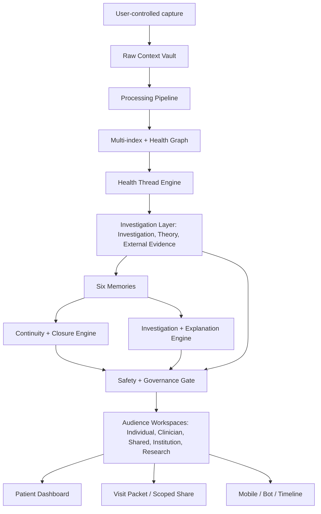

# Architecture

The operating loop is **Capture → Connect → Investigate → Clarify → Close → Correct**. The Investigation Layer (L6) implements the Investigate step; Audience Workspaces (L9) present every output through grant-scoped, role-specific surfaces.

## Layer summary

|layer_id|layer_name|purpose|wellbe_v1_modules|new_or_extended_components|risk_level|
|---|---|---|---|---|---|
|L0|Trust, consent, and personal control|The user owns scope, sharing, corrections, retention, and cross-patient opt-in.|M02 Auth & Consent; settings-and-privacy|Share Grants; Consent Scopes; Cross-Patient Opt-In Gate; Revocation Logs|High|
|L1|Personal Data Factory|Capture raw context immutably, with provenance, before reasoning.|M03 Raw Context Vault; M04 Processing Pipeline; M28 Ingestion Layer|Patient-held record import; out-of-system care import; document/photo/SMS/manual provenance|Medium|
|L2|Extraction, indexing, and graph|Transform raw data into source-linked entities, facts, events, signals, and relationships.|M04; M09; M16; M26|Evidence Traceability 2.0; Clinical/Event Type Ontology; Thread Evidence Links|Medium|
|L3|Health Thread Memory|Represent unresolved or ongoing health concerns as longitudinal threads across symptoms, tests, visits, referrals, and patient story.|M22 Concern Tracker; M10/M11/M12; timeline; graph-explorer|Health Thread Engine; Thread State Machine; Unresolved Status; Thread Similarity/Linking|High|
|L4|Six memories|Maintain story, clinical, pattern, decision, responsibility, and equity/access memories around each Health Thread.|M05-M08; M10-M16; M22|Story Memory; Clinical Memory; Pattern Memory; Decision Memory; Responsibility Memory; Equity & Access Memory|High|
|L5|Continuity and closure engine|Track open loops after visits: pending results, referrals, unresolved symptoms, post-discharge instructions, deterioration, and repeat visits.|M22; doctor-summary; investigation-triage|Pending Item Ledger; Referral Lifecycle; Result Tracker; Post-Visit Plan Checker; Repeat-Visit View|High|
|L6|Investigation layer (Investigate step)|Run structured research over threads: Investigations, Theories, External Evidence Graph + Research Watch, Live Metrics monitor; help users ask better questions and see what changed.|M13-M20; M23; M25; C8/C9|C14 Investigation Engine; C15 Theory Service; C16 External Evidence Graph + Research Watch; Normal-Test Explainer; Missing Data Checklist; Theory Evaluator|Medium-high (engine risk-tiered)|
|L7|Safety, privacy, and governance|Prevent diagnosis claims, panic language, unsafe instructions, bias amplification, alert overload, and privacy violations.|M21 Safety & Triage; M02; M26|Clinical Safety Case Log; Feature Risk Register; False Positive/Negative Review; Bias Controls; per-engine safety tiers; source-quality + clinical-review markers|Very high|
|L8|User surfaces and shareable outputs|Present memory as simple, layered interfaces: dashboard, Health Thread, visit prep, doctor packet, post-visit checks, mobile/bot logging.|M29/M30/M32/M33; frontend-core; timeline; doctor-summary|Health Thread Dashboard; Visit Packet; Full Health Context Summary; Pending Loop Inbox; Correction Review; Share Link/Export|Medium|
|L9|Audience workspaces|Role-specific, grant-scoped surfaces over the shared primitives; the individual is always the data controller.|new|C17 Workspace/Role/Grant; Individual; Clinician Case Investigation; Shared Health Thread; Institution Continuity (aggregate-only); Research Sandbox (opt-in)|Very high|

## New components (integrated)

| Component | Layer | Doc reference |
|---|---|---|
| Knowledge Graph (typed nodes, scored edges, visualization) | L2 | `knowledge_graph.md` |
| Intelligence Engines (pattern, temporal, confounder, contradiction, missing data) | L3/L4 | `intelligence_engines.md` |
| Mood / Energy Logging | L1 | `system_design.md` — Data Capture |
| Wearable Integration | L1 | `integrations.md` |
| Cross-Device Intelligence | L2 | `integrations.md` |
| Environmental Context Ingestion | L1 | `integrations.md` |
| Medical Institution Integration (user-pull FHIR) | L1 | `integrations.md` |
| Research Agent + Myth Buster | L6 | `feature-backlog/feature_backlog.md` — WB2-F035, F036 |
| Health-Adaptive UI | L8 | `feature-backlog/feature_backlog.md` — WB2-F040 |

All integrations write through the same Data Factory path (L1). The Knowledge Graph (L2) is the primary input for Intelligence Engines (L3/L4). Research Agent and Myth Buster operate at L6 (investigation/explanation). Health-Adaptive UI reads from L7 (safety triage output) and L3 (baseline deviation).

## Architectural rule

The Safety + Governance Gate runs before any user-facing AI output. Lower layers must not depend on upper layers. The Health Thread Engine can consume Data Factory outputs, but it cannot overwrite raw context or remove provenance.
