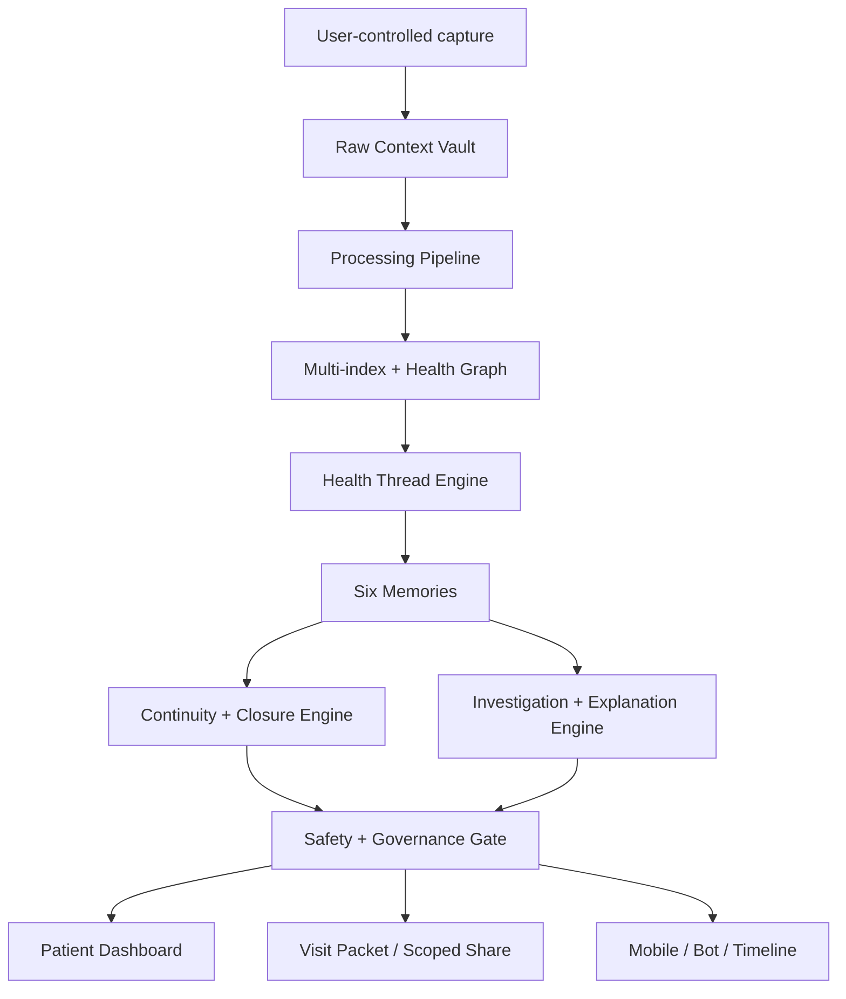

# Architecture

## Layer summary

|layer_id|layer_name|purpose|wellbe_v1_modules|new_or_extended_components|risk_level|
|---|---|---|---|---|---|
|L0|Trust, consent, and personal control|The user owns scope, sharing, corrections, retention, and cross-patient opt-in.|M02 Auth & Consent; settings-and-privacy|Share Grants; Consent Scopes; Cross-Patient Opt-In Gate; Revocation Logs|High|
|L1|Personal Data Factory|Capture raw context immutably, with provenance, before reasoning.|M03 Raw Context Vault; M04 Processing Pipeline; M28 Ingestion Layer|Patient-held record import; out-of-system care import; document/photo/SMS/manual provenance|Medium|
|L2|Extraction, indexing, and graph|Transform raw data into source-linked entities, facts, events, signals, and relationships.|M04; M09; M16; M26|Evidence Traceability 2.0; Clinical/Event Type Ontology; Thread Evidence Links|Medium|
|L3|Health Thread Memory|Represent unresolved or ongoing health concerns as longitudinal threads across symptoms, tests, visits, referrals, and patient story.|M22 Concern Tracker; M10/M11/M12; timeline; graph-explorer|Health Thread Engine; Thread State Machine; Unresolved Status; Thread Similarity/Linking|High|
|L4|Six memories|Maintain story, clinical, pattern, decision, responsibility, and equity/access memories around each Health Thread.|M05-M08; M10-M16; M22|Story Memory; Clinical Memory; Pattern Memory; Decision Memory; Responsibility Memory; Equity & Access Memory|High|
|L5|Continuity and closure engine|Track open loops after visits: pending results, referrals, unresolved symptoms, post-discharge instructions, deterioration, and repeat visits.|M22; doctor-summary; investigation-triage|Pending Item Ledger; Referral Lifecycle; Result Tracker; Post-Visit Plan Checker; Repeat-Visit View|High|
|L6|Investigation and explanation|Help users ask better questions, see what changed, identify missing context, and prepare safe clinician conversations.|M13-M20; M23; M25; C8/C9|Normal-Test Explainer; Missing Data Checklist; Thread Questions; Myth/Personal Theory Checker|Medium-high|
|L7|Safety, privacy, and governance|Prevent diagnosis claims, panic language, unsafe instructions, bias amplification, alert overload, and privacy violations.|M21 Safety & Triage; M02; M26|Clinical Safety Case Log; Feature Risk Register; False Positive/Negative Review; Bias Controls|Very high|
|L8|User surfaces and shareable outputs|Present memory as simple, layered interfaces: dashboard, Health Thread, visit prep, doctor packet, post-visit checks, mobile/bot logging.|M29/M30/M32/M33; frontend-core; timeline; doctor-summary|Health Thread Dashboard; Visit Packet; Pending Loop Inbox; Correction Review; Share Link/Export|Medium|

## Architectural rule

The Safety + Governance Gate runs before any user-facing AI output. Lower layers must not depend on upper layers. The Health Thread Engine can consume Data Factory outputs, but it cannot overwrite raw context or remove provenance.
